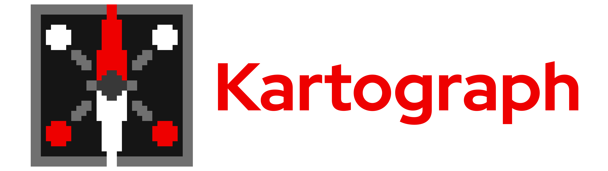

> [!Warning]
>
> Kartograph is an experimental effort and is in the early stages
> of construction.

<h3 align="center">Unlocking Institutional Knowledge</h3>
<h3 align="center">Democratizing Secure Property Graph Creation</h3>

 
 
 

# What is Kartograph?

Kartograph is an enterprise-ready property graph as a service platform.

Images are [built on Konflux](https://konflux-ui.apps.kflux-prd-rh02.0fk9.p1.openshiftapps.com/ns/kartograph-tenant/applications/kartograph) and [published to Quay](https://quay.io/repository/redhat-user-workloads/kartograph-tenant/kartograph-api?tab=tags&tag=latest).

## Documentation

Refer to the latest
[Kartograph Documentation](https://openshift-hyperfleet.github.io/kartograph)
to learn more.

## Contributing

Please see [CONTRIBUTING.md](./CONTRIBUTING.md) and [the documentation](https://openshift-hyperfleet.github.io/kartograph/getting-started/contributing/)
