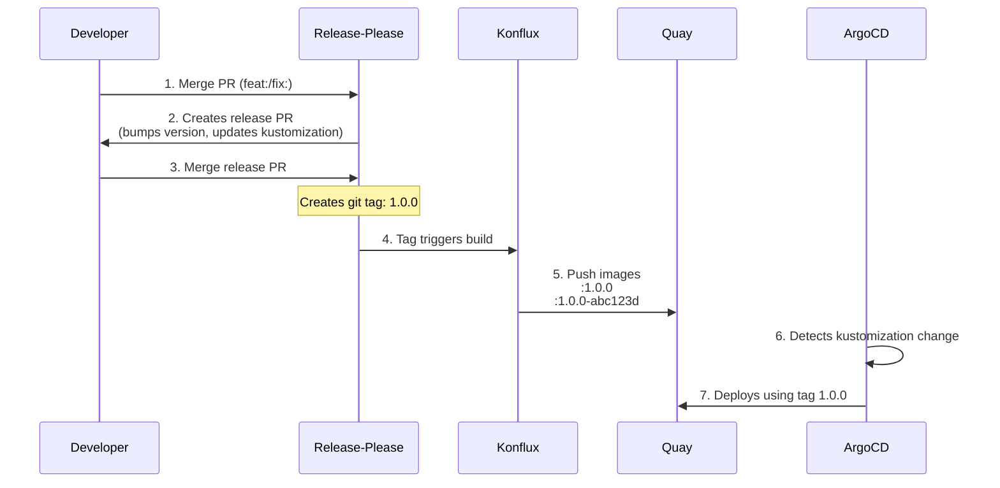

# Kartograph Deployment

## Release Flow

## Key Points

- **Conventional commits** (feat:, fix:) trigger version bumps
- **Git tags** trigger Konflux builds (NOT every commit to main)
- **Image tags**: Both `1.0.0` (mutable) and `1.0.0-abc123d` (immutable) created
- **Kustomization**: References `newTag: 1.0.0` (updated by release-please)
- **Rollback**: Change kustomization to specific `1.0.0-abc123d` tag

## Files Updated Automatically

- `deploy/apps/kartograph/overlays/stage/kustomization.yaml` - Release-please updates `newTag`
- `CHANGELOG.md` - Release-please generates changelog
- Git tag (e.g., `1.0.0`) - Release-please creates on merge

## Manual Operations

- Merge release PRs (quality gate before production)
- Emergency rollback (edit kustomization to pin specific SHA tag)
