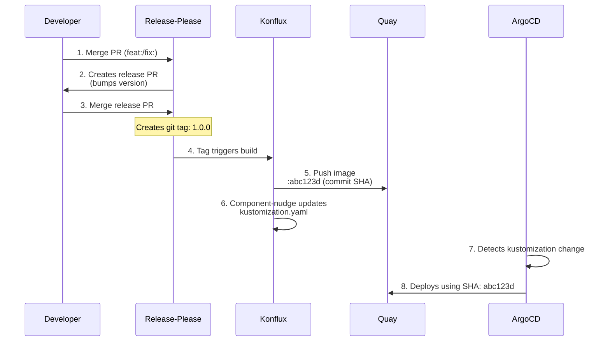

# Kartograph Deployment

## Release Flow

## Key Points

- **Conventional commits** (feat:, fix:) trigger version bumps
- **Git tags** trigger Konflux builds (NOT every commit to main)
- **Image tag**: `abc123d` (commit SHA from the tagged release)
- **Kustomization**: Auto-updated by component-nudge after each build
- **Version tracking**: Git tag `1.0.0` points to commit `abc123d`
- **Images location**: `quay.io/redhat-user-workloads/kartograph-tenant/kartograph-api`

## Files Updated Automatically

- `deploy/apps/kartograph/overlays/stage/kustomization.yaml` - Konflux updates `newTag` with commit SHA
- `CHANGELOG.md` - Release-please generates changelog
- `src/api/pyproject.toml` - Release-please bumps version
- Git tag (e.g., `1.0.0`) - Release-please creates on merge

## Manual Operations

- Merge release PRs (quality gate before production)
- Emergency rollback (edit kustomization to pin older commit SHA)
