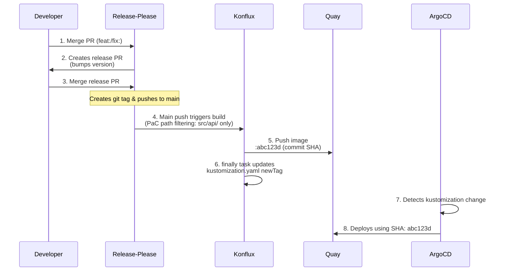

# Kartograph Deployment

## Release Flow

## Key Points

- **Conventional commits** (feat:, fix:) trigger version bumps
- **Merging release PR** triggers Konflux builds (pushes to main)
- **PaC path filtering**: Only changes under `src/api/` (or the pipeline YAML itself) trigger the `kartograph-api` build; changes to `deploy/`, docs, or other components do not
- **Image tag**: commit SHA (e.g., `20537154d73b5b8f8ced3cfabc56f6a841068e99`)
- **Auto-tag update**: A `finally` task in the push pipeline commits the new tag to `kustomization.yaml` after a successful image build
- **No rebuild loop**: The tag-update commit only touches `deploy/`, which is excluded by PaC path filtering
- **Images location**: `quay.io/redhat-user-workloads/kartograph-tenant/kartograph-api`

## Image Tag Update Mechanism

The push pipeline includes a `finally` task (`update-deploy-tag`) that runs after a successful image build. It:

1. Shallow-clones the repo
2. Updates `newTag` in `deploy/apps/kartograph/overlays/stage/kustomization.yaml` with the build's commit SHA
3. Commits and pushes directly to `main`

Because PaC path filtering is configured on the Tekton pipelines, this commit (which only touches `deploy/`) does **not** trigger a rebuild of any component.

## Files Updated Automatically

- `deploy/apps/kartograph/overlays/stage/kustomization.yaml` — `finally` task updates `newTag` with commit SHA after each build
- `CHANGELOG.md` — Release-please generates changelog
- `src/api/pyproject.toml` — Release-please bumps version
- Git tag (e.g., `1.0.0`) — Release-please creates on merge

## Manual Operations

- Merge release PRs (quality gate before production)
- Emergency rollback (edit kustomization to pin older commit SHA)
