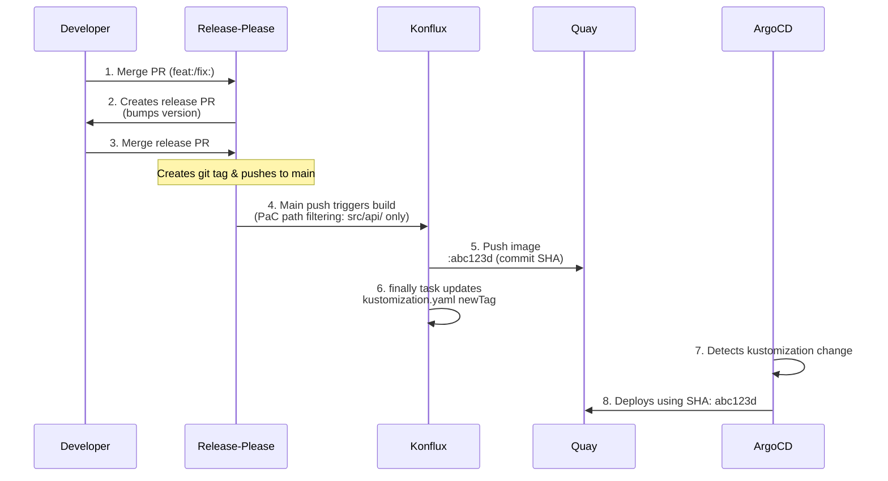

# Kartograph Deployment

> [!Important]
>
> `deploy/apps/kartograph` in this repo is **deprecated**. Stage/prod manifests live in
> [hp-fleet-gitops (GitHub)](https://github.com/openshift-online/hp-fleet-gitops/tree/main/apps/kartograph),
> which is both what ArgoCD deploys and where Konflux opens deploy-tag PRs.
>
> Until 2026-07-01, ArgoCD read [fleet-apps (GitLab)](https://gitlab.cee.redhat.com/hybrid-platforms-gitops/tenant-apps/fleet-apps/-/tree/main/apps/kartograph)
> instead, and hp-fleet-gitops was a separate mirror that only received automated
> image-tag-bump PRs. [hp-gitops-tenants PR #9](https://github.com/openshift-online/hp-gitops-tenants/pull/9)
> repointed the `hp-fleet` ApplicationSet at hp-fleet-gitops directly, so there is now a
> single source of truth again. `fleet-apps` is no longer read by ArgoCD for kartograph and
> should be treated as historical; `scripts/verify-fleet-apps-kartograph.sh` is kept only to
> spot future drift if that ever changes back.

## Release Flow

```mermaid
sequenceDiagram
    participant Dev as Developer
    participant RP as Release-Please
    participant K as Konflux
    participant Q as Quay
    participant A as ArgoCD

    Dev->>RP: 1. Merge PR (feat:/fix:)
    RP->>Dev: 2. Creates release PR<br/>(bumps version)
    Dev->>RP: 3. Merge release PR
    Note over RP: Creates git tag & pushes to main
    RP->>K: 4. Main push triggers build<br/>(PaC path filtering: src/api/ only)
    K->>Q: 5. Push image<br/>:abc123d (commit SHA)
    K->>K: 6. finally task updates<br/>kustomization.yaml newTag
    A->>A: 7. Detects kustomization change
    A->>Q: 8. Deploys using SHA: abc123d
```

## Key Points

- **Conventional commits** (feat:, fix:) trigger version bumps
- **Merging release PR** triggers Konflux builds (pushes to main)
- **PaC path filtering**: Only changes under `src/api/` (or the pipeline YAML itself) trigger the `kartograph-api` build; changes to `deploy/`, docs, or other components do not
- **Image tag**: commit SHA (e.g., `20537154d73b5b8f8ced3cfabc56f6a841068e99`)
- **Auto-tag update**: A `finally` task in the push pipeline commits the new tag to `kustomization.yaml` after a successful image build
- **No rebuild loop**: The tag-update commit only touches `deploy/`, which is excluded by PaC path filtering
- **Images location**: `quay.io/redhat-user-workloads/kartograph-tenant/kartograph-api`

## Image Tag Update Mechanism

The push pipeline includes a `finally` task (`update-deploy-tag`) that runs after a successful image build. It:

1. Shallow-clones the repo
2. Updates `newTag` in `apps/kartograph/overlays/stage/kustomization.yaml` on **hp-fleet-gitops** (opens a PR)
3. Merging that PR is picked up directly by ArgoCD — no second repo to sync

Because PaC path filtering is configured on the Tekton pipelines, this commit (which only touches `deploy/`) does **not** trigger a rebuild of any component.

## Files Updated Automatically

- `apps/kartograph/overlays/stage/kustomization.yaml` on **hp-fleet-gitops** — Konflux `finally` task opens PR with new image SHAs; ArgoCD deploys from the same repo once merged
- `CHANGELOG.md` — Release-please generates changelog
- `src/api/pyproject.toml` — Release-please bumps version
- Git tag (e.g., `1.0.0`) — Release-please creates on merge

## Manual Operations

- Merge release PRs (quality gate before production)
- Emergency rollback (edit kustomization to pin older commit SHA)
