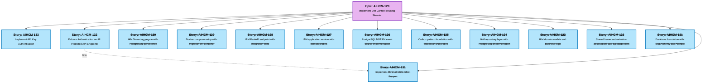

# Work Item Tree: AIHCM-120

**Type:** Epic  
**Summary:** Implement IAM Context Walking Skeleton

```mermaid
graph TD
    AIHCM_120["<b>Epic: AIHCM-120</b><br/><small>Implement IAM Context Walking Skeleton</small>"]:::epic
    AIHCM_133["<b>Story: AIHCM-133</b><br/><small>Implement API Key Authentication</small>"]:::story
    AIHCM_120 --> AIHCM_133
    AIHCM_132["<b>Story: AIHCM-132</b><br/><small>Enforce Authentication on All Protected API Endpoints</small>"]:::story
    AIHCM_120 --> AIHCM_132
    AIHCM_131["<b><s>Story: AIHCM-131</s></b><br/><small><s>Implement Minimal OIDC SSO Support</s></small>"]:::story
    AIHCM_132 -.link.-> AIHCM_131
    AIHCM_120 --> AIHCM_131
    AIHCM_130["<b><s>Story: AIHCM-130</s></b><br/><small><s>IAM Tenant aggregate with PostgreSQL persistence</s></small>"]:::story
    AIHCM_120 --> AIHCM_130
    AIHCM_129["<b><s>Story: AIHCM-129</s></b><br/><small><s>Docker compose setup with migration init container</s></small>"]:::story
    AIHCM_120 --> AIHCM_129
    AIHCM_128["<b><s>Story: AIHCM-128</s></b><br/><small><s>IAM FastAPI endpoint with integration tests</s></small>"]:::story
    AIHCM_120 --> AIHCM_128
    AIHCM_127["<b><s>Story: AIHCM-127</s></b><br/><small><s>IAM application service with domain probes</s></small>"]:::story
    AIHCM_120 --> AIHCM_127
    AIHCM_126["<b><s>Story: AIHCM-126</s></b><br/><small><s>PostgreSQL NOTIFY event source implementation</s></small>"]:::story
    AIHCM_120 --> AIHCM_126
    AIHCM_125["<b><s>Story: AIHCM-125</s></b><br/><small><s>Outbox pattern foundation with processor and probes</s></small>"]:::story
    AIHCM_120 --> AIHCM_125
    AIHCM_124["<b><s>Story: AIHCM-124</s></b><br/><small><s>IAM repository layer with PostgreSQL implementation</s></small>"]:::story
    AIHCM_120 --> AIHCM_124
    AIHCM_123["<b><s>Story: AIHCM-123</s></b><br/><small><s>IAM domain models and business logic</s></small>"]:::story
    AIHCM_120 --> AIHCM_123
    AIHCM_122["<b><s>Story: AIHCM-122</s></b><br/><small><s>Shared kernel authorization abstractions and SpiceDB client</s></small>"]:::story
    AIHCM_120 --> AIHCM_122
    AIHCM_121["<b><s>Story: AIHCM-121</s></b><br/><small><s>Database foundation with SQLAlchemy and Alembic</s></small>"]:::story
    AIHCM_120 --> AIHCM_121

    click AIHCM_120 "https://issues.redhat.com/browse/AIHCM-120" "Open AIHCM-120 in Jira" _blank
    click AIHCM_133 "https://issues.redhat.com/browse/AIHCM-133" "Open AIHCM-133 in Jira" _blank
    click AIHCM_132 "https://issues.redhat.com/browse/AIHCM-132" "Open AIHCM-132 in Jira" _blank
    click AIHCM_131 "https://issues.redhat.com/browse/AIHCM-131" "Open AIHCM-131 in Jira" _blank
    click AIHCM_130 "https://issues.redhat.com/browse/AIHCM-130" "Open AIHCM-130 in Jira" _blank
    click AIHCM_129 "https://issues.redhat.com/browse/AIHCM-129" "Open AIHCM-129 in Jira" _blank
    click AIHCM_128 "https://issues.redhat.com/browse/AIHCM-128" "Open AIHCM-128 in Jira" _blank
    click AIHCM_127 "https://issues.redhat.com/browse/AIHCM-127" "Open AIHCM-127 in Jira" _blank
    click AIHCM_126 "https://issues.redhat.com/browse/AIHCM-126" "Open AIHCM-126 in Jira" _blank
    click AIHCM_125 "https://issues.redhat.com/browse/AIHCM-125" "Open AIHCM-125 in Jira" _blank
    click AIHCM_124 "https://issues.redhat.com/browse/AIHCM-124" "Open AIHCM-124 in Jira" _blank
    click AIHCM_123 "https://issues.redhat.com/browse/AIHCM-123" "Open AIHCM-123 in Jira" _blank
    click AIHCM_122 "https://issues.redhat.com/browse/AIHCM-122" "Open AIHCM-122 in Jira" _blank
    click AIHCM_121 "https://issues.redhat.com/browse/AIHCM-121" "Open AIHCM-121 in Jira" _blank

    classDef feature fill:#ff9800,stroke:#e65100,stroke-width:3px,color:#000
    classDef epic fill:#e8b4f0,stroke:#9b4dca,stroke-width:3px,color:#000
    classDef story fill:#b3e5fc,stroke:#0277bd,stroke-width:2px,color:#000
    classDef task fill:#c8e6c9,stroke:#388e3c,stroke-width:1px,color:#000
    classDef bug fill:#ffcdd2,stroke:#c62828,stroke-width:2px,color:#000
```
