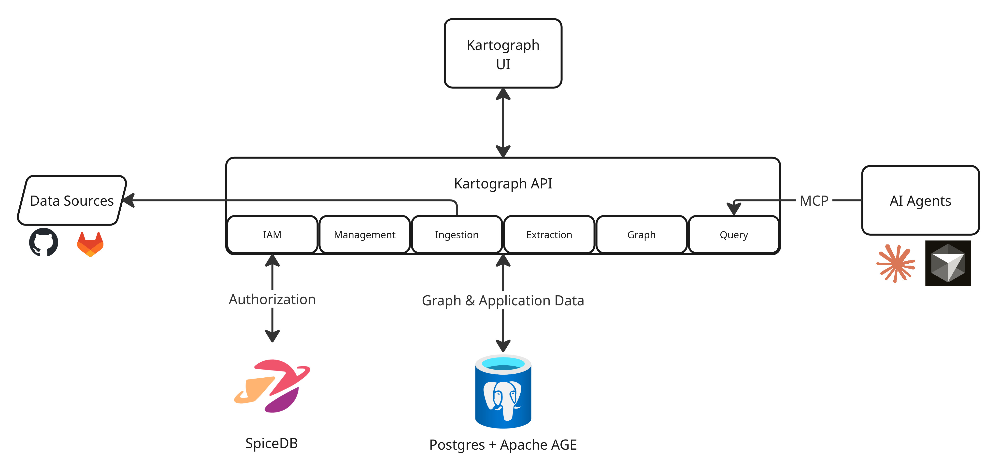

import { Badge } from '@astrojs/starlight/components';

## High-Level Overview

:::caution
Kartograph is still under active construction. This page describes the desired end state
of Kartograph. Badges are used to describe the state of each component: 

- <Badge text="Not Started" variant="danger" /> No work done on this item
- <Badge text="In-Progress" variant="caution" /> Work has begun but the item is not in a usable state
- <Badge text="MVP" variant="tip" /> The item is minimally usable, but is not fully functional
- <Badge text="Complete" variant="success" /> The item is usable and fully functional
:::

Kartograph can be described at a high level with the following components:

### Kartograph UI <Badge text="Not Started" variant="danger" />

The Kartograph UI provides a low-friction interface to creating and managing
knowledge graphs and the data sources that feed them.

### Kartograph API

The Kartograph API, built as a modular monolith, is the engine that powers
the Kartograph platform. Its functionality is best described by its six 
bounded contexts (also referred to as _domains_, see [Martin Fowler on DDD](https://martinfowler.com/bliki/DomainDrivenDesign.html) to learn more.)

- **IAM** <Badge text="In-Progress" variant="caution" />

    The Identity and Access Management (IAM) domain handles authentication and authorization. 
    Fine-grained authorization is achieved via SpiceDB.

- **Management** <Badge text="Not Started" variant="danger" />

    The management domain is responsible for handling knowledge graph and data source
    settings. It manages graph names, data source credentials, sync schedules, and more.

- **Ingestion** <Badge text="Not Started" variant="danger" />

    The ingestion handles the retrieval of data from data sources. It uses a pluggable
    adapter pattern that, in theory, allows connecting arbitrary data sources to Kartograph.
    In practice, every new data source type requires the creation of an adapter before it can be ingested.

    The Kartograph team is committed to using its limited resources to provide
    adapters for the most popular data sources. We welcome contributions from the community!

- **Extraction** <Badge text="In-Progress" variant="caution" />

    The extraction domain handles the transformation of a data source into a set of entities
    and relationships that will make up a graph. 

    LLM-based agents are the core engine behind the extraction. We are actively iterating on the
    methodology, and are currently using the [Agent SDK from Anthropic](https://platform.claude.com/docs/en/agent-sdk/overview).

    As of writing, the extraction domain is expected to produce a JSON lines (JSONL) file containing
    mutation operations (`DEFINE`/`CREATE`/`UPDATE`/`DELETE`), which will be applied by the graph domain.

- **Graph** <Badge text="MVP" variant="tip" />

    The graph domain is responsible for managing interactions with the knowledge graphs. It takes the JSONL
    produced by the extraction domain and applies the changes to a graph. 

    An abstract protocol is used at the infrastructure layer of the graph domain such that, in theory,
    Kartograph can support any graph database backend. In practice, we only provide support for the 
    Postgres extension [Apache AGE](https://age.apache.org/).

- **Query** <Badge text="MVP" variant="tip" />

    The query domain is the "front door" to graph data for AI agents (or other consumers). At this time,
    the query domain exposes a [model context protocol (MCP)](https://modelcontextprotocol.io/docs/getting-started/intro)
    that provides a tool and several resources that enable agents to execute [openCypher](https://opencypher.org/) queries.

    To learn more, see the [MCP Sever Guide](../../guides/mcp-server).

## Typical User Journey

The following contrived user story helps to illustrate the intended user journey.

Let's assume that Alice and Bob are members of a team named Catalyst that wants to build a knowledge graph
from three of their GitHub repos.

1. Bob opens the [Kartograph UI](#kartograph-ui) and creates a new team called "Catalyst", and adds Alice as an administrator.
1. Alice also logs in and creates a new graph called "Catalyst-Repos".
1. Alice then connects the team's GitHub repos as data sources for the "Catalyst-Repos" graph. She specifies that she wants 
   Kartograph to sync the latest data from their repos every 24 hours.
1. Since this is a new graph, Kartograph immediately initiates an extraction job. It fetches the data from the git repos, and
   the extraction agent begins extracting entities and relationships.
1. The initial extraction completes and the data is ingested into the graph by the graph domain. 
1. At this point, Alice and Bob see that their graph is ready. They copy the command to register the Kartograph MCP server 
   with Claude Code, which gives the agent access to connected context built from their team's three git repos.