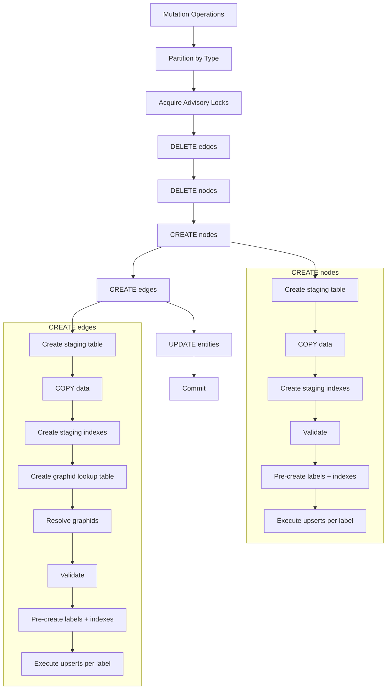

import { Aside, Tabs, TabItem } from '@astrojs/starlight/components';


<Aside type="caution">
This page is AI generated and requires human review and editing.
</Aside>


## Overview

Kartograph uses a custom bulk loading strategy to achieve high-throughput graph mutations with Apache AGE. Instead of using Cypher's `MERGE` (which is slow for large batches), we bypass Cypher entirely and write directly to AGE's internal PostgreSQL tables.

**This approach achieves > 100x faster performance than Cypher MERGE for large batches.**

### Why Not Cypher MERGE?

Apache AGE translates Cypher queries into PostgreSQL execution plans. For `MERGE` operations, this translation is expensive—each entity requires parsing, planning, and executing a complex query. For 50,000 nodes, that's 50,000 separate query plans.

Our approach:
1. Load all data into a temporary staging table via PostgreSQL `COPY`
2. Execute a single `INSERT...SELECT` or `UPDATE...FROM` per label
3. Let PostgreSQL's query planner optimize the bulk operation

## Execution Flow



### Operation Order

Operations execute in a specific order to maintain referential integrity:

| Step | Operation | Reason |
|------|-----------|--------|
| 1 | DELETE edges | Remove edges before their nodes |
| 2 | DELETE nodes | Safe now that edges are gone |
| 3 | CREATE nodes | Nodes must exist before edges reference them |
| 4 | CREATE edges | Now safe to reference nodes |
| 5 | UPDATE | Property changes on existing entities |

## Index Strategy

Indexes are critical to performance. Without them, every upsert would trigger a full table scan.

### Permanent Indexes (Per Label)

Created once when a label is first used. These persist across batches.

| Index | Type | Column | Purpose |
|-------|------|--------|---------|
| `id_btree` | BTREE | `id` | Fast graphid lookups |
| `props_gin` | GIN | `properties` | Property-based Cypher queries |
| `prop_id_text_btree` | BTREE | `agtype_object_field_text_agtype(properties, '"id"')` | Logical ID lookups |
| `start_id_btree` | BTREE | `start_id` | Edge traversal (edges only) |
| `end_id_btree` | BTREE | `end_id` | Edge traversal (edges only) |

<Aside type="caution">
The `prop_id_text_btree` expression index is critical. It must match the exact expression used in WHERE clauses, or PostgreSQL won't use it.
</Aside>

### Temporary Indexes (Per Batch)

Created during bulk loading, dropped on commit.

| Index | Table | Column | Purpose |
|-------|-------|--------|---------|
| `label_idx` | Staging | `label` | Fast filtering when processing each label |
| `start_id_idx` | Edge staging | `start_id` | Graphid resolution join |
| `end_id_idx` | Edge staging | `end_id` | Graphid resolution join |
| `logical_id_idx` | Lookup table | `logical_id` | Fast ID→graphid mapping |

### Why Pre-Create Indexes?

Indexes are created **before** upserts, not after. This ensures the `UPDATE` and `INSERT` queries can use index-backed lookups:

```sql
-- This WHERE clause needs the expression index to be fast:
UPDATE graph.Label AS t
SET properties = ...
FROM staging AS s
WHERE ag_catalog.agtype_object_field_text_agtype(
    t.properties, '"id"'::ag_catalog.agtype
) = s.id
```

Without the index, this query scans the entire table for every row.

## The Graphid Lookup Table

Apache AGE uses table inheritance: each label is a child table of `_ag_label_vertex` or `_ag_label_edge`. Querying the parent table scans **all** child tables.

### The Problem

```sql
-- Querying _ag_label_vertex scans ALL vertex labels
SELECT id FROM graph._ag_label_vertex
WHERE agtype_object_field_text_agtype(properties, '"id"') = 'some-id'
```

With 1,692 vertex labels, this generates a query plan with 1,692 separate scans—even with indexes on each table.

**Observed performance:**
- Planning time: ~123ms
- Execution time: ~28ms per lookup

For 250,000 edges needing graphid resolution, this would take hours.

### The Solution

Build a flat lookup table once per batch:

```sql
CREATE TEMP TABLE _graphid_lookup AS
SELECT
    agtype_object_field_text_agtype(properties, '"id"') AS logical_id,
    id AS graphid
FROM graph._ag_label_vertex;

CREATE INDEX ON _graphid_lookup (logical_id);
```

Then resolve all graphids with a single join:

```sql
UPDATE staging_edges AS s
SET start_graphid = lk.graphid
FROM _graphid_lookup AS lk
WHERE lk.logical_id = s.start_id;
```

**Observed performance:**
- Lookup table creation: ~160ms (one-time cost)
- Per-lookup: ~0.03ms

This is ~1000x faster for edge resolution.

## Staging Tables

Staging tables use PostgreSQL's `COPY` protocol for fast bulk loading.

<Tabs>
<TabItem label="Nodes">
```sql
CREATE TEMP TABLE _staging_nodes (
    id TEXT NOT NULL,
    label TEXT NOT NULL,
    properties JSONB NOT NULL
) ON COMMIT DROP;
```
</TabItem>

<TabItem label="Edges">
```sql
CREATE TEMP TABLE _staging_edges (
    id TEXT NOT NULL,
    label TEXT NOT NULL,
    start_id TEXT NOT NULL,
    end_id TEXT NOT NULL,
    start_graphid graphid,  -- resolved later
    end_graphid graphid,    -- resolved later
    properties JSONB NOT NULL
) ON COMMIT DROP;
```
</TabItem>
</Tabs>

Data is loaded via `COPY FROM STDIN`, which bypasses SQL parsing entirely.

## Validation

Before executing upserts, the system validates:

1. **Duplicate IDs** - Same ID appearing multiple times in a batch
2. **Orphaned edges** - Edges referencing non-existent nodes (detected by NULL graphids after resolution)

Both conditions raise errors and roll back the transaction.

## Concurrency

Advisory locks prevent race conditions when multiple processes create the same label simultaneously:

```sql
SELECT pg_advisory_xact_lock(hash('graph:Label'))
```

Locks are transaction-scoped and released on commit.

## FAQs

<details>
<summary>How many entities can be processed in one batch?</summary>

The system has been tested with 50,000 nodes and 250,000 edges in a single transaction. Performance scales linearly with batch size.
</details>

<details>
<summary>Why use JSONB in staging tables instead of agtype?</summary>

JSONB is faster for PostgreSQL's COPY protocol and standard operators. We convert to agtype only when inserting into the final AGE tables.
</details>

<details>
<summary>What happens if a batch fails partway through?</summary>

The entire transaction rolls back. No partial writes occur.
</details>

<details>
<summary>Why are edge graphids resolved separately for start and end?</summary>

Joining on both simultaneously creates a cartesian product. Two separate UPDATE statements are faster.
</details>

## Code References

The bulk loading implementation lives in `graph/infrastructure/age_bulk_loading/`:

| File | Purpose |
|------|---------|
| `strategy.py` | Main orchestration |
| `queries.py` | SQL query builders |
| `staging.py` | Staging table management |
| `indexing.py` | Permanent index creation |
| `utils.py` | Validation and hashing utilities |
