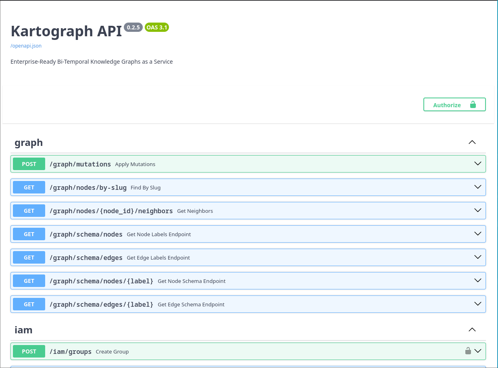
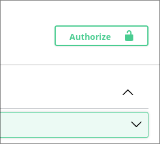
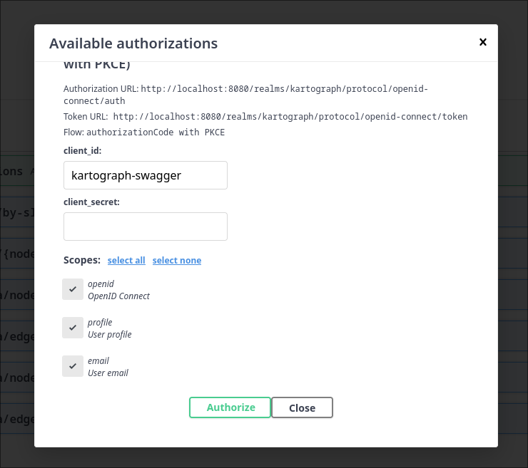
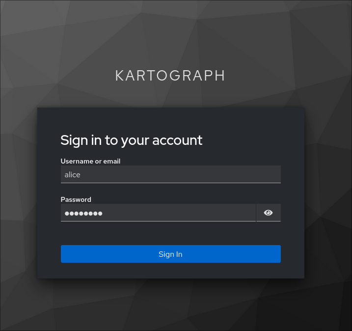
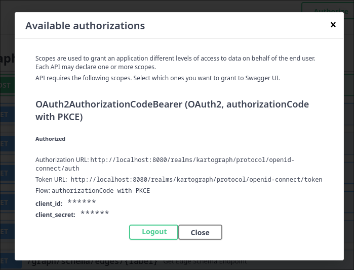

import { Steps, Code, Aside } from '@astrojs/starlight/components';

## Prerequisites

- Python 3.12 or higher
- UV package manager
- Docker (for Apache AGE database)

## Installation

<Steps>
1. **Clone the repository**
   ```bash
   git clone https://github.com/openshift-hyperfleet/kartograph.git
   cd kartograph
   ```

1. **Install Git Hooks**

   `pre-commit` and `pre-push` hooks are configured to enforce
   coding standards and validate code with tests. The first time
   you commit, `pre-commit` will install required packages automatically.
   This may take some time, but will only happen once.
   
   ```bash
   uv run pre-commit install -t pre-commit -t pre-push
   ```

1. **Configure environment**
   
   Default Kartograph configuration files can be found in
   `/env`. 

1. **Run Kartograph**

   Kartograph can quickly be run in development mode using `docker compose`:
   ```bash
   make dev && make logs
   ```
   This will first start the database, a local Keycloak instance, and the application services with
   auto-reload enabled.
</Steps>

## Using the Swagger UI

One of the easiest ways to interact with the API routes is through the Swagger docs UI. 
You can find the UI at: http://localhost:8000/docs.



### Authentication

Kartograph only supports authentication via OIDC (API keys are also planned for the future).
Swagger's UI is configured to authenticate with the development Keycloak instance via an OIDC flow.

<Steps>
1. **Click the green `Authorize` button**
   


1. **Scroll down and click `Authorize`**

   A dialog will appear that auto-populates the `client_id` and
   required scopes for the development environment.

   Scroll down and click `Authorize` to be redirected to Keycloak.

   


1. **Authenticate with Keycloak**

   Sign in with one of the two developer accounts configured in [`keycloak/realm.json`](https://github.com/openshift-hyperfleet/kartograph/blob/main/keycloak/realm.json):

   | Username | Password |
   | -------- | -------- |
   | `alice`    | `password` |
   | `bob`      | `password` |
   
   


1. **Verify Authentication**

   You will be redirected back to the Swagger UI, and the dialog should
   display a `Logout` button, indicating the authentication has succeeded. 

   At this time, you can click `Close` to interact with the API.

   As you make requests, the Bearer token derived from the authentication flow
   will automatically be sent with requests.

   

</Steps>