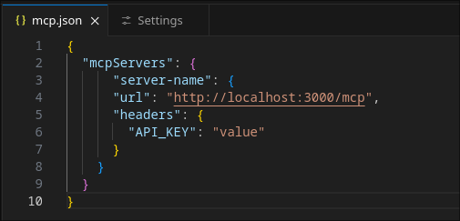
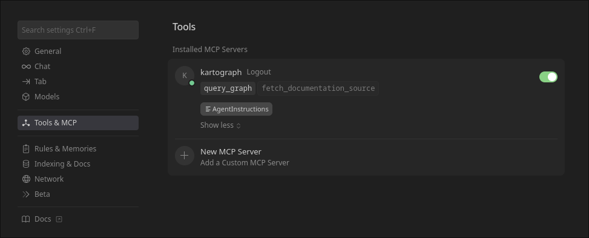

import { Tabs, TabItem, Aside, Code, Steps } from '@astrojs/starlight/components';
import { Kbd } from 'starlight-kbd/components'

## Overview

Kartograph provides an MCP (Model Context Protocol) server at `/query/mcp` that enables AI agents to query the knowledge graph using [openCypher](https://opencypher.org) and discover the graph schema.

## Connection

Provided that you have [started the Kartograph development server](../../getting-started/quickstart/#installation),
the Kartograph MCP server can be registered with Claude Code:

### Claude Code

Add the Kartograph MCP server to Claude Code by 
running this command in your terminal.

```bash
claude mcp remove kartograph # Remove any prior versions
claude mcp add \
  --transport http \
  kartograph \
  http://localhost:8000/query/mcp \
  --scope user # Allow access from any project
```

<Aside type="tip">
Kartograph supports fetching some raw data from GitHub
and GitLab. If you wish to enable this functionality,
you must pass in access tokens from each service
when adding the MCP server.

The tokens must have `read` repository access.

```bash
claude mcp remove kartograph # Remove any prior versions
claude mcp add \
  --transport http \
  kartograph \
  http://localhost:8000/query/mcp \
  --header "x-github-pat: <your-pat-here>" \
  --header "x-gitlab-pat: <your-token-here>" \
  --scope user # Allow access from any project
```
</Aside>

### Cursor

<Steps>
1. **Open Cursor Settings**

    Open Cursor settings by typing <Kbd mac="Cmd+Shift+J" linux="Ctrl+Shift+J"/>,
    or via menu: `File` -> `Preferences` -> `Cursor Settings`.

1. **Select Tools & MCP**

    In the Cursor Settings left sidebar, select `Tools & MCP`.

    

1. **Open MCP Server Settings**

   Depending on whether you have previously added an MCP server to Cursor,
   either click "Add Custom MCP" or "New MCP Server" (at the bottom of the server list.)

   This will open up Cursor's `mcp.json` settings file. This file will either contain
   configuration for existing MCP servers, or an empty object like:

   ```json
    {
      "mcpServers": {}
    }
   ```

   

1. **Add Kartograph MCP Server Configuration**
   
   To add Kartograh's MCP server to cursor, add the following JSON object 
   inside the existing `mcpServers` object:

   ```json
   "kartograph": {
      "url": "http://localhost:8000/query/mcp",
      "headers": {
        "x-github-pat": "<your-pat-here>",
        "x-gitlab-pat": "<your-token-here>"
      }
    }
   ```

   The full file should look something like: 
   ```json
    {
      "mcpServers": {
          "kartograph": {
          "url": "http://localhost:8000/query/mcp",
          "headers": {
            "x-github-pat": "<your-pat-here>",
            "x-gitlab-pat": "<your-token-here>"
          }
        }
      }
    }
   ```

   <Aside type="tip">
    Kartograph supports fetching some raw data from GitHub
    and GitLab. If you wish to enable this functionality,
    you must pass in access tokens from each service
    via `headers` as shown above.
    </Aside>

1. **Save the File**

   To finish adding the Kartograph MCP server to Cursor, save the `mcp.json`
   and re-open Cursor Settings -> MCP & Tools.

   Here, you should see the Kartograph MCP server listed, as shown below.

   
</Steps>

## Resources

Resources provide read-only access to graph schema information.

### `schema://ontology`

Complete graph ontology with all type definitions.

**Returns:**
```json
{
  "type_definitions": [
    {
      "label": "person",
      "entity_type": "node",
      "description": "A person entity representing an individual",
      "required_properties": ["name"],
      "optional_properties": ["email", "role"]
    }
  ],
  "count": 1
}
```

### `schema://nodes/labels`

List of all node type labels.

**Returns:**
```json
{
  "labels": ["person", "project", "repository"],
  "count": 3
}
```

### `schema://edges/labels`

List of all edge type labels.

**Returns:**
```json
{
  "labels": ["knows", "depends_on", "contributes_to"],
  "count": 3
}
```

### `schema://nodes/{label}`

Detailed schema for a specific node type.

**Example:** `schema://nodes/person`

**Returns:**
```json
{
  "label": "person",
  "entity_type": "node",
  "description": "A person entity",
  "required_properties": ["name"],
  "optional_properties": ["email", "role"]
}
```

### `schema://edges/{label}`

Detailed schema for a specific edge type.

**Example:** `schema://edges/knows`

**Returns:**
```json
{
  "label": "knows",
  "entity_type": "edge",
  "description": "Professional relationship",
  "required_properties": ["since"],
  "optional_properties": []
}
```

## Tools

### `query_graph`

Execute read-only Cypher queries against the knowledge graph.

**Parameters:**
- `cypher` (string, required) - Cypher query to execute
- `timeout_seconds` (int, default: 30, max: 60) - Query timeout
- `max_rows` (int, default: 1000, max: 10000) - Maximum results

:::caution[Apache AGE Single-Column Requirement]
Due to limitations with how Apache AGE handles Cypher queries,
all queries must be written to return a single column. Multiple values
can be returned by using map syntax to return a single column that contains 
multiple values:

```cypher
// Single value
MATCH (p:Person) RETURN p

// Multiple values - use map
MATCH (a:Person)-[r:KNOWS]->(b:Person)
RETURN {source: a, relationship: r, target: b}
```
:::

**Example Request:**
```json
{
  "cypher": "MATCH (p:Person) RETURN p LIMIT 5",
  "timeout_seconds": 30,
  "max_rows": 100
}
```

**Success Response:**
```json
{
  "success": true,
  "rows": [
    {"node": {"id": "person:abc123", "label": "Person", "properties": {"name": "Alice"}}}
  ],
  "row_count": 1,
  "truncated": false,
  "execution_time_ms": 42.5
}
```

**Error Response:**
```json
{
  "success": false,
  "error_type": "forbidden",
  "message": "Query must be read-only. Found forbidden keyword: CREATE"
}
```

## Workflow

1. Use `schema://nodes/labels` and `schema://edges/labels` to discover available types
2. Use `schema://nodes/{label}` or `schema://edges/{label}` to understand type properties
3. Write Cypher queries using `query_graph` tool based on the schema
