## Overview

The **Secure Enclave Pattern** enables intra-tenant connected context. The intent is to securely enable the discovery
of cross-data relationships, even across security boundaries.

Imagine a scenario where Alice is an engineer working on the public OpenShift Console repository. She is investigating a memory leak. 
There is a known, but embargoed security vulnerability (CVE) that identifies the root cause of this leak in a specific upstream library, `npm:axios`.

Alice does not have read access to the embargoed CVEs. However, the relationships in Kartograph allow her AI agent to discover the dependency without revealing the sensitive details of the vulnerability itself.

The AI agent can see that `openshift/console` is affected by a `cve` that has a root cause in `npm:axios`, but sensitive information like the CVE number 
and vulnerability details are redacted. The agent only sees the non-identifying secure ID of the CVE (`4418c846ef82aeef`, a hash of `CVE-2025-01`).

```mermaid
graph LR
    A([openshift/console]) -- Affected By --> B["🔒 cve:4418c846ef82aeef"]
    B -- Root Cause --> C([npm:axios])
    
 

    style A fill:#e6f3ff,stroke:#333,stroke-width:2px
    style B fill:#ffe6e6,stroke:#ff0000,stroke-width:2px,stroke-dasharray: 5 5
    style C fill:#e6f3ff,stroke:#333,stroke-width:2px
```

:::note
While not currently in scope for Kartograph, the ability for AI agents or humans to
securely request access to redacted information via a secure ID is intriguing.
:::

## How It Works

Kartograph provides secure connected context via:
- **Database-level tenant isolation** prevents malicious queries from leaking data
- **Native classification controls at the data source level** allow access-based content filtering
- **Tenant-scoped secure IDs for nodes and relationships** prevent correlation between tenants in the event of a zero-day that enables queries to query across databases
    - This can also enable secure deterministic inter-graph linking of nodes.
- **ReBAC-based post-query redaction of data stored in the secure enclave** ensures clients only receive data they are cleared to see
